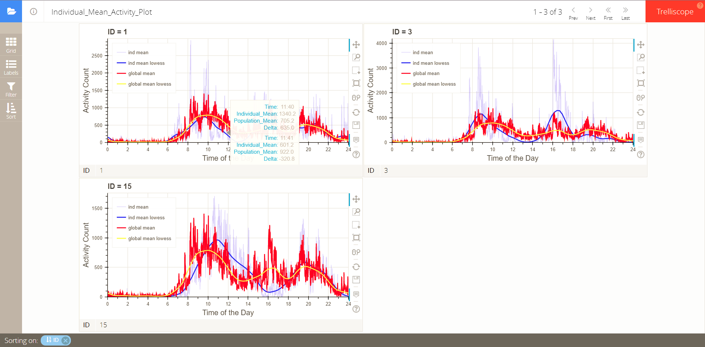
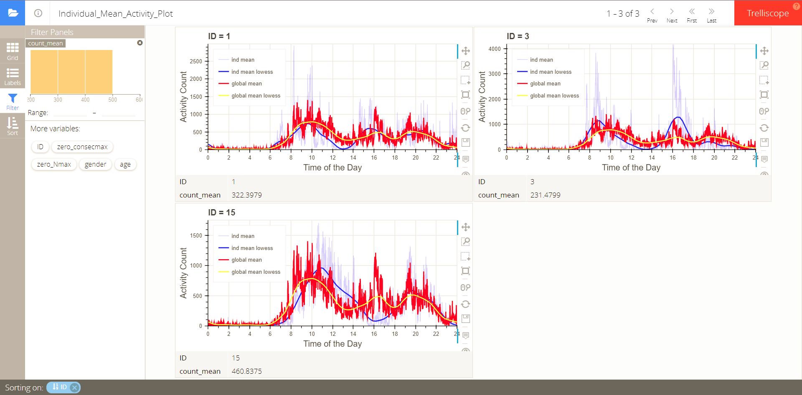
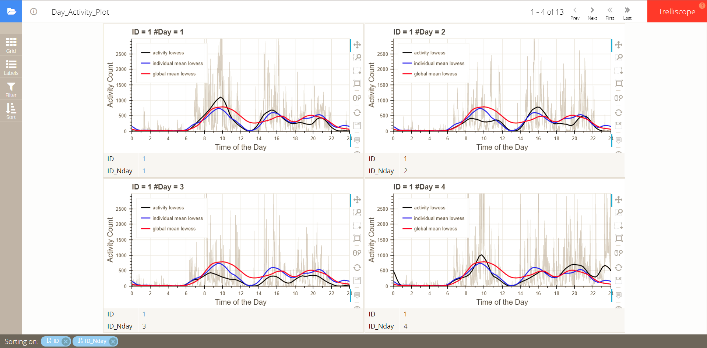

## Introduction

This vignette gives examples on how to apply penalized multi-band learning to accelerometer data to analyze circadian rhythms. Specifically, it uses L1/L2 combined penalty to select important harmonics sequentially. To conduct statistical tests to pick significant harmonics, functions for Fisher's harmonic test are also included. In addition, one can use functions on trelliscope visualization to plot individual mean activities compared to the population mean activity, and individual day activities compared to the individual mean activity and the population mean activity.

## Penalized Multi-band Learning

We use a synthetic dataset to implement the method. 'lis3' is a data list consisting of three matrices, each giving activity data for one individual. Each column of the matrix is one-day observation, and here the physical activity (PA) is measured every one minute, so the matrix is 1440 by 'nday'. 'lis3' is also a named list, the name of which is the individual ID.

To convert the data to the required format as the input of the function for penalized multi-band learning, we use function 'form':
```{r,warning=F}
suppressMessages(library(PML))
data(lis3)
pa3 <- form(lis3)
pa3
```
The resulting dataset 'pa3' is in tbl_df format. It has 13 observations for 3 individuals, and the variables are "ID", "ID_Nday" (the ith day observation for an individual), and activity. The activity variable is an embedded list with each element consisting of a vector of one-day observation.

Further, 'pa3' serves as part of the input for the function `bandSelect`. It uses combined L1/L2 penalty to select important harmonics sequentially based on Fast Fourier Transform (FFT) results. $X_k$ is the vector of the $k$th harmonic FFT results. $\lambda$ is the tuning parameter for penalty, and it ranges from 0 (no penalty) to 2max($||X_k||^2$). $\theta_i$'s are the estimated coefficents for different harmonics given a specified penalty.

`alpha`: controls the balance between L1 and L2 penalties. Because here we want to pick a few important harmonics, we set $\alpha$=1 to use L1 penalty only. 

`Nlength`: In the analysis we need to use individual observations of equal lengths (equal number of day observations), because different lengths of inputs into FFT will result in different sets of harmonics and expect different magnitudes of signals (i.e. for certain harmonics, the signals are expected to be stronger in observations of longer time). Therefore, we use the 'Nlength' argument to specify the length of observation for an individual to be entered into the analysis. Here we choose 3 days, namely 1440*3 observations per individual. We then show the top 3 important harmonics in the population ('Ntop=3'). Because the sample data only have 3 individuals, we do not perform 5-fold cross-validation ('cross=FALSE'). 

`plot=TRUE`: We want to see the effect of the first a few harmonics compared to other harmonics and all harmonics, so we plot Mean Squared Error (MSE) against the number of nonzero $\theta$'s as $\lambda$ decreases. Note that it only plots the points whether the number of nonzero $\theta$'s increases; between plotted points, the values of the already nonzero $\theta$'s increase.

```{r,fig.width=7,fig.height=5,out.width = "100%"}
data(pa3)
re <- bandSelect(df=pa3,Nlength=1440*3,Nlambda=100,alpha=1,Ntop=3,
                 cross=FALSE,Ncross=NULL,plot=TRUE)
```

The top five frequencies are 1440, 720, 480, corresponding to 1-day, 1/2-day, and 1/3-day periodicities. The convolution of the three frequencies can give two-peak day activity patterns, with one activity peak in the morning, one peak in the afternoon and evening, and interims of one short nap in the afternoon and one long sleep at night. The output 'xscore' and 'xprop' gives FFT results (signal magnitudes and proportions standardized by individuals respectively) in 3 by 2159 matrices, with row standing for 3 individuals and column standing for 2159 frequencies. We may want to see the top frequencies with mean signal proportions:

```{r,results="hide"}
freq <- data.frame(Frequency=re$freq,Proportion=colMeans(re$xprop))
rownames(freq) <- NULL
head(freq[order(freq$Proportion,decreasing = TRUE),],5)
```
```{r, echo=FALSE, results='asis'}
knitr::kable(head(freq[order(freq$Proportion,decreasing = TRUE),],5),row.names = FALSE)
```

As is shown in the table, the top three proportions are quite dominant.

## Fisher's Harmonic Test
To conduct statistical tests on FFT results, we can apply the tests developed by R.A. Fisher (1929). Because we are testing multiple frequencies simultaneously, it is better to incorporate procedures to correct for it. Here we use the Bonferroni correction. The function `test.harmonic` takes the observation as the input and gives the significant frequencies (the first insignificant frequency will also be given).

```{r}
## no significant frequencies
ob <- do.call("c",pa3$activity[1:4])
re <- test.harmonic(ob,p=0.05/(length(ob)-1)/2)
re$sig;head(re$fft) 
```

For the first individual, no significant frequency is detected.

```{r}
## 3 significant frequencies
ob2 <- do.call("c",pa3$activity[11:13])
re2 <- test.harmonic(ob2,p=0.05/(length(ob2)-1)/2) 
re2$sig;head(re2$fft) 
```

For the third individual, 3 significant frequencies are detected.

To conduct tests on the population level, we can use the mean FFT proportions from previous results (dataset freq) as input:

```{r}
re3 <- test.harmonic(freq,p=0.05/nrow(freq),fft=TRUE)
print(re3$sig,digits=3,row.names=FALSE)
```

The harmonic tests pick out 8 significant frequencies.

## Trelliscope Visualization
It is often of interest to see the actual daily activity patterns and compare different individuals with different characteristics. Trelliscope makes it easy to see the plots and interactively sort and filter them based on covariates. 

Here we can use the function `tre` to generate trelliscope panels based on activity data. The required data format is the same as `lis3`, with each element as the activty matrix, the column of which is one-day activity observation. We can either see the individual mean plots or all the daily activity plots. If we are only interested in each individual compared to the population as a whole, we can set `plot.ind=TRUE`, and the default is TRUE.

```{r,eval=FALSE}
#### directly display trelliscope panels, no dataset is returned
tre(lis3,plot.ind=TRUE,plot.tre=TRUE)
```
```{r,echo=FALSE,out.width = "100%"}

```

The variables that can be used to filter plots include ID, mean activity counts, total number of zero counts per day, and maximal number of consecutive zero counts per day. 

We can always incorporate more variables for filtering, labelling, and sorting, using the `varlis` argument. The covariate dataset needs to have the first column as "ID", so that it can be merged to the activity data.

```{r}
#### return a dataset with trelliscope panels
data(var3)
tre.ind <- suppressWarnings(tre(lis3,plot.ind=TRUE,varlis=var3)) 
```
```{r,eval=FALSE}
tre.ind$activity_ind <- tre.ind$activity_all <- NULL ## prepare for visualization; no lists are allowed
trelliscopejs::trelliscope(tre.ind,name = "Day Activity Plot", nrow = 2, ncol = 2,path=getwd())
```
```{r,echo=FALSE,out.width = "100%"}

```

If we merge covariates with the activity data using `varlis=var3`, in the trelliscope panels we can filter by the covariates: age and gender.

On the other hand, if we are interested in daily activity plots in addition to individual mean activity plots, we can set `plot.ind=FALSE`.

```{r,eval=FALSE}
tre(lis3,varlis=var3,plot.ind=FALSE,plot.tre=TRUE)
```
```{r,echo=FALSE,out.width = "100%"}

```

It plots all the daily activity plots for each individual. The plots can also be filtered or sorted based on variables in the merged covariate dataset.
